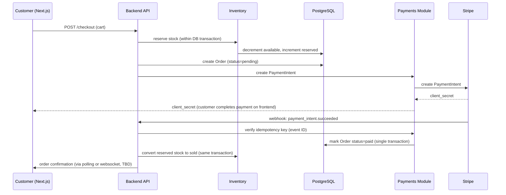
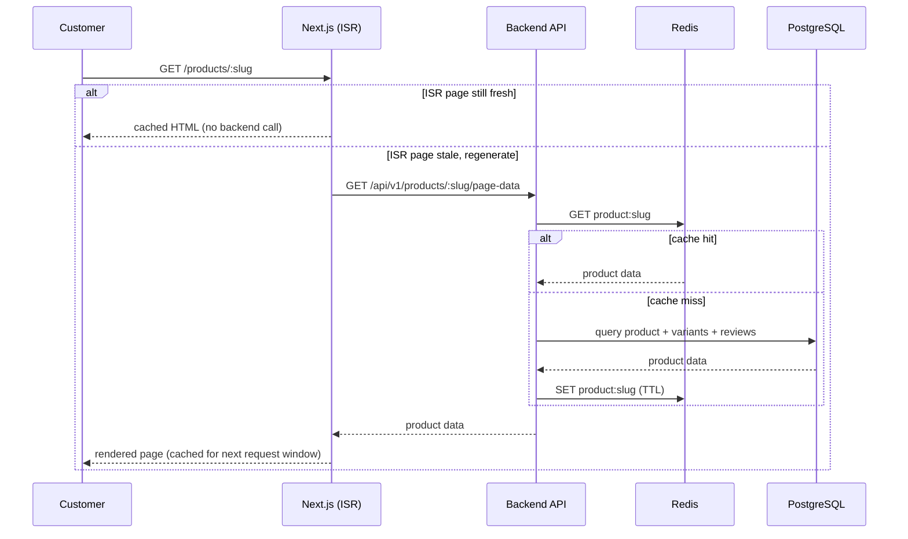

# 6. Runtime View

*(arc42 Section 6 — Key runtime scenarios)*

## 6.1 Scenario: Checkout & Payment

**Key design point:** stock reservation happens *before* payment confirmation (to prevent overselling during the payment gap), and is converted to a permanent decrement only inside the same transaction that marks the order paid. If payment fails or times out, a scheduled job releases reserved stock back to available (see 11-risks-and-technical-debt.md — this reconciliation job is a real piece of work, not automatic).

## 6.2 Scenario: Product Page Read (cache-aside)

