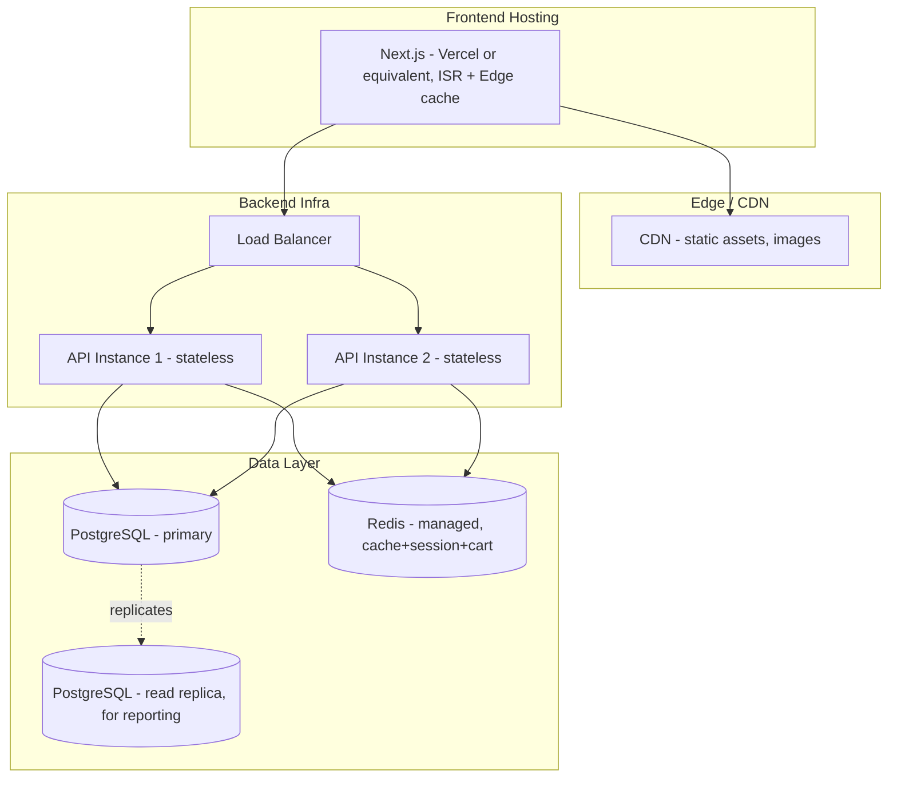

# 7. Deployment View

*(arc42 Section 7 — Hardware, infrastructure, deployment)*

| Node | Notes |
|---|---|
| **Next.js hosting** | Chosen for its native ISR/edge-cache support, directly serving the Performance quality goal. |
| **Backend API instances** | Kept **stateless** deliberately — no in-memory session/cart state — so horizontal scaling is just "add another instance behind the load balancer," no sticky sessions needed. |
| **PostgreSQL primary + read replica** | Reporting/admin queries (sales dashboards) run against the replica so they never compete with checkout-path writes for connections. |
| **Redis** | Single managed instance to start; a solo-developer constraint (2.2) rules out running a self-managed Redis cluster from day one. Documented as a scaling lever, not a day-one requirement. |
| **Docker** | `base_server` already ships dev/prod Dockerfiles — reused as the containerization baseline for the API instances. |

**Deliberately deferred (not needed at current stated scale):** container orchestration (Kubernetes), multi-region deployment, database sharding. Introducing these now, for a single-vendor store's stated scale, would repeat the same YAGNI mistake flagged in ADR-0001 for the database.
