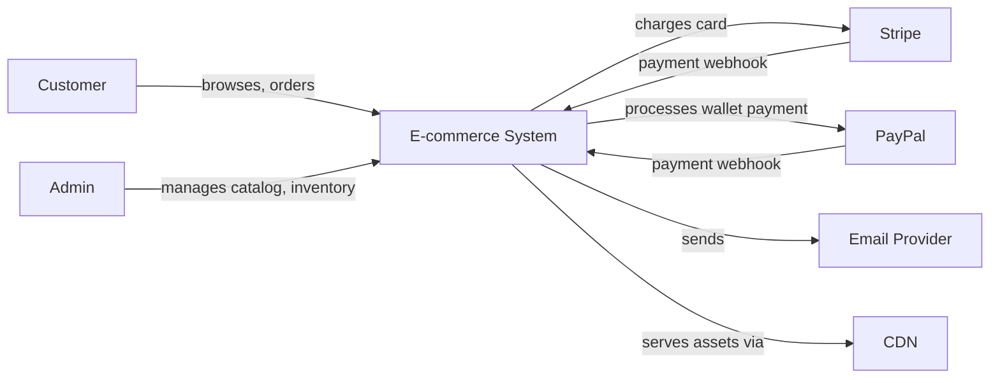

# 3. Context & Scope

*(arc42 Section 3 — Business and Technical Context, External Interfaces)*

## 3.1 Business Context

| Actor | Interaction |
|---|---|
| **Customer** | Browses catalog, manages cart, checks out, tracks orders |
| **Store Owner / Admin** | Manages products, inventory, views orders and sales reports |
| **Stripe** | Card payment processing, Payment Intents, webhooks for payment confirmation |
| **PayPal** | Secondary wallet payment method |
| **Email Provider** (e.g. SendGrid/SES) | Order confirmation, shipping updates, password reset |
| **CDN** | Serves static assets and product images |

## 3.2 Technical Context

| Interface | Protocol | Direction |
|---|---|---|
| Customer/Admin ↔ Next.js Frontend | HTTPS | Bidirectional |
| Next.js Frontend ↔ Backend API | HTTPS/REST/JSON | Bidirectional |
| Backend ↔ Stripe | HTTPS/REST (outbound), Webhook (inbound) | Bidirectional |
| Backend ↔ PayPal | HTTPS/REST (outbound), Webhook (inbound) | Bidirectional |
| Backend ↔ PostgreSQL | TCP/SQL | Backend-initiated |
| Backend ↔ Redis | TCP/RESP | Backend-initiated |
| Backend → Email Provider | HTTPS/REST (fire-and-forget, as in `base_server`'s existing email pattern) | Outbound only |

> **Note:** Webhooks (Stripe/PayPal → Backend) are the one interface where the *external* system initiates contact — this is the interface most likely to need retry/idempotency handling (see `08-crosscutting-concepts.md`).
