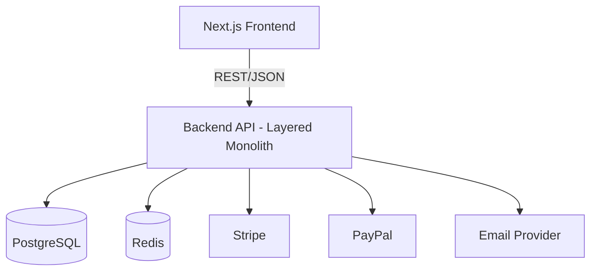

# 5. Building Block View

*(arc42 Section 5 — Structure of the system, hierarchically refined. Usually the most extensive section.)*

## 5.1 Level 1 — Whitebox Overall System



## 5.2 Level 2 — Backend Domain Modules

Each module follows `base_server`'s existing pattern: `Router → Controller → Service → Repository → Model`.

| Module | Responsibility |
|---|---|
| **Auth** | Registration, login, logout, token refresh, password reset (reused from `base_server`, re-pointed at PostgreSQL) |
| **Catalog** | Products, categories, variants, images (metadata; actual images on CDN) |
| **Cart** | Cart lines, stored in Redis (short-lived, high-write, doesn't need relational durability) |
| **Checkout/Orders** | Order creation, order status lifecycle, ties cart → payment → inventory together |
| **Payments** | Stripe/PayPal integration, webhook handlers, idempotency ledger |
| **Inventory** | Stock levels, reservation during checkout, decrement on confirmed payment |
| **Admin** | Product/category management, order management, sales reporting (relational joins across Orders/Products/Users) |
| **Notifications** | Order confirmation, shipping update, password-reset emails (fire-and-forget, as in `base_server`) |
| **Search** | Product search via PostgreSQL full-text (`tsvector`) — see ADR-0003 |

## 5.3 Folder Structure

*(extending `base_server`'s existing convention)*

```
src/
  APIs/
    catalog/          (products, categories, variants)
    cart/              (Redis-backed, no repository layer needed)
    checkout/          (orchestrates cart + payments + inventory)
    payments/          (Stripe/PayPal adapters, webhook handlers)
    inventory/
    user/
      authentication/   (reused from base_server, repo swapped to Prisma)
      management/        (now actually implemented — was a stub in base_server)
    admin/
    notifications/
    search/
    _shared/            (shared types, DB client instance, common middlewares)
  middlewares/          (authenticate, rateLimiter [now Redis-backed], errorHandler)
  services/              (database, redis, email, stripe-client, paypal-client)
```

This is a direct extension of `base_server`'s file-structure convention (as documented in the earlier code review) — not a rewrite of the pattern, only a repository-layer swap and new sibling modules alongside the existing `user` module.
