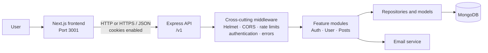
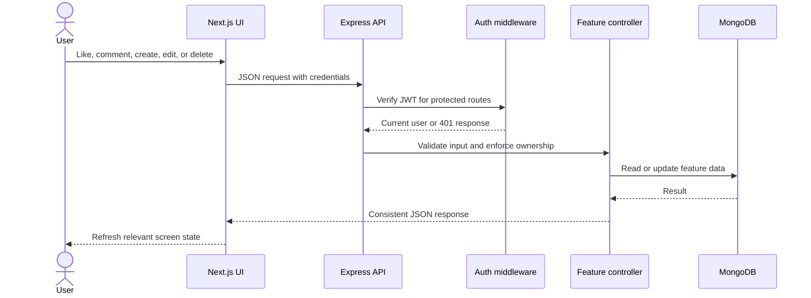
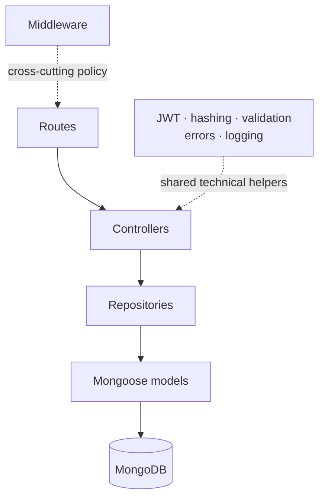
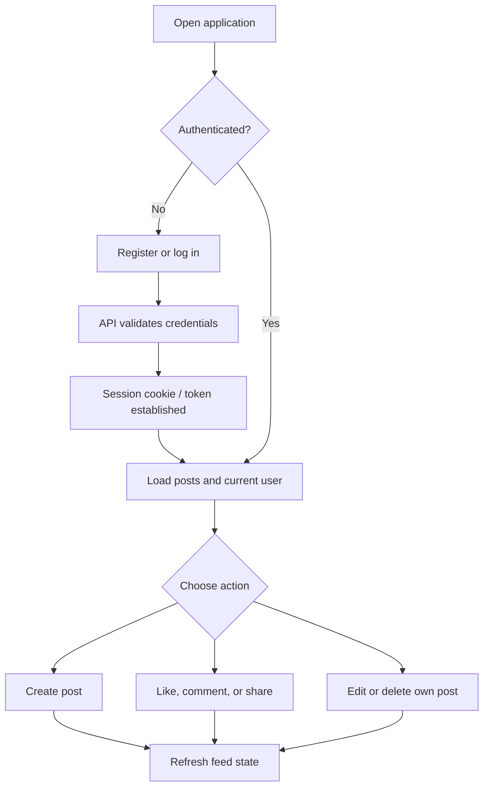
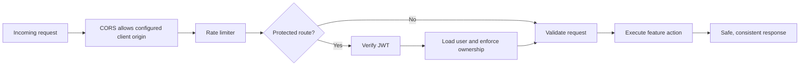

# Social Media Post

A full-stack social media application built as a modular monolith. The Next.js web client lets users register, sign in, create and manage posts, like, comment, share, update a profile image, and view notifications. The Express API owns authentication, authorization, validation, business actions, and MongoDB persistence.

## Architecture at a glance



The application is deployed as one backend unit, but its feature folders establish clear ownership boundaries. Browser code never accesses MongoDB directly.

## Repository layout

```text
.
├── base server frontend/       Next.js 16 + React 19 web client
│   ├── app/                    Home, login, registration, application shell
│   ├── components/             Auth form, post composer, post card
│   ├── lib/                    Typed API client and UI contracts
│   └── tests/                  Vitest component tests
├── base_server/                Express + TypeScript API
│   ├── src/APIs/               Auth, user-management, and post modules
│   ├── src/middlewares/        Authentication, rate limiting, error handling
│   ├── src/services/           MongoDB and email adapters
│   ├── src/utils/              JWT, hashing, validation, health helpers
│   ├── src/__tests__/          Jest API tests
│   └── docker/                 Development and production Dockerfiles
└── system_architecture_report.docx
                              Detailed architecture reference
```

## Request flow

Every protected action follows the same path. The frontend can give fast feedback, but the backend remains the authority for identity, permissions, and input validity.



## Backend module boundaries



| Module | Ownership | Main capabilities |
| --- | --- | --- |
| Authentication | Registration, confirmation, login, logout, tokens | Creates and clears authenticated sessions |
| User management | Current user, profile settings, follows, notifications | Uses authenticated identity supplied by middleware |
| Posts | Posts, likes, comments, shares | Validates writes and checks post ownership for edits/deletes |
| Middleware and handlers | Security and response policy | CORS, Helmet, rate limits, authentication, 404 and error handling |

## User-facing flow



## API overview

The API root is `/v1`. Standard responses use a JSON envelope with `success`, `statusCode`, `message`, and `data`.

| Area | Endpoints |
| --- | --- |
| General | `GET /v1/health`, `GET /v1/self` |
| Authentication | `POST /v1/register`, `PATCH /v1/registeration/confirm/:token`, `POST /v1/login`, `PUT /v1/logout` |
| User | `GET/PATCH /v1/user/me`, `GET /v1/user/notifications`, `PUT /v1/user/:userId/follow` |
| Posts | `GET/POST /v1/posts`, `GET/PATCH/DELETE /v1/posts/:postId` |
| Interactions | `PATCH /v1/posts/:postId/like`, `POST /v1/posts/:postId/comments`, `POST /v1/posts/:postId/share` |

> Note: `registeration` is the currently implemented route spelling and is retained here so the documentation accurately matches the API.

## Security model



- Helmet sets security-related HTTP headers.
- CORS accepts the configured `CLIENT_URL` and supports credentials; serve API traffic over HTTPS in production.
- JWT authentication protects account and post-write actions.
- Post edits and deletions require the current user to own the post.
- Joi schemas validate feature input; JSON bodies are capped at 5 MB.
- Rate limiting protects the exposed routes from abuse.

## Run locally

### Prerequisites

- Node.js and npm
- A MongoDB connection string
- Email-provider and JWT secrets for authentication flows

### 1. Start the API

```powershell
Set-Location 'base_server'
npm install
npm run start:dev
```

Configure the backend environment before starting. Its runtime configuration reads `PORT`, `CLIENT_URL`, `DATABASE_URL`, `EMAIL_SERVICE_API_KEY`, `ACCESS_TOKEN_SECRET`, and `REFRESH_TOKEN_SECRET`. The default client origin is `http://localhost:3001` and the API route prefix is `/v1`.

### 2. Start the frontend

In a second terminal:

```powershell
Set-Location 'base server frontend'
npm install
$env:NEXT_PUBLIC_API_URL = 'http://localhost:3000/v1'
npm run dev
```

Open [http://localhost:3001](http://localhost:3001). If your backend uses a different port or host, set `NEXT_PUBLIC_API_URL` to its `/v1` URL.

## Quality checks

```powershell
# Backend
Set-Location 'base_server'
npm run build
npm test
npm run lint

# Frontend
Set-Location '..\base server frontend'
npm run build
npm test
```

## Growth path

The next capabilities should remain internal modules until independent scaling or deployment needs are proven:

1. Profile privacy and blocking rules.
2. A personalized, paginated feed over posts and follows.
3. Authorized media uploads backed by object storage.
4. Event-driven notifications with delivery tracking.
5. Moderation reports, decisions, roles, and audit history.
6. Private messaging with participant-only access checks.

For the detailed design rationale and implementation map, see [the system architecture report](system_architecture_report.docx).
