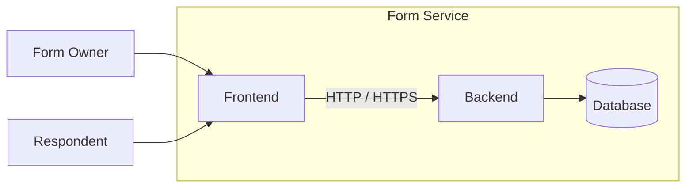

# 1. Introduction

## Overview

The Form Service is a web-based system for creating, configuring, publishing, and submitting forms.

The system consists of two primary subsystems:

- Frontend — user-facing form builder, form management, and response interfaces.
- Backend — form domain, validation, authorization, persistence, and API services.

The architecture separates presentation concerns from application and data concerns so that either side can evolve independently.

## Scope

This document describes the architectural structure and interaction model of the Form Service.

## System Boundary

## Architectural Intent

The system is designed to keep responsibilities separate:

- Frontend manages user experience and interface behavior.
- Backend manages validation, rules, and persistence.
- Database remains behind the service layer and is not accessed directly by the client.

This separation supports maintainability, modifiability, and independent evolution of the user interface and backend logic.
