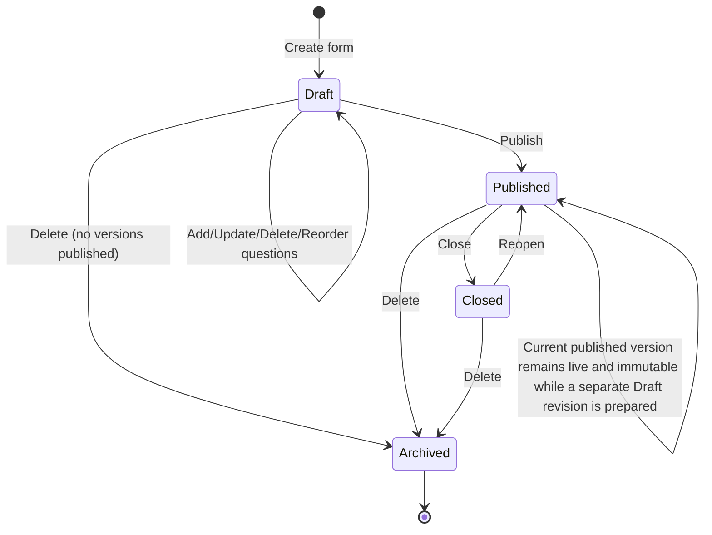

# 2. Background and Functional Requirements

## 2.1 Background

The system provides functionality comparable to a simplified Google Forms platform.

The primary users are:

- Form Owner — creates and manages forms.
- Respondent — accesses published forms and submits responses.

The existing Base Server architecture provides the backend conventions that this service should follow, including controller/service/repository separation and shared authentication, error handling, and response mechanisms.

## 2.2 Functional Requirements

### Form Management

- Create form
- Update form
- Delete form
- Retrieve form
- List forms
- Publish form
- Close form

### Question Management

- Add questions
- Update questions
- Delete questions
- Reorder questions
- Configure question types and options

### Response Management

- Submit response
- Validate response against form definition
- Retrieve responses
- Paginate responses

### Frontend

- Form dashboard
- Form builder
- Question editor
- Form preview
- Published form
- Response interface
- Response viewer

## 2.3 Quality Attributes

The primary architectural drivers are:

### Usability

The form builder should allow users to create and configure forms without unnecessary navigation.

Frontend components should provide immediate validation feedback and clear form states.

### Maintainability

Frontend and backend responsibilities must remain separated.

Backend features should be modular and follow the existing Base Server structure.

Frontend components should be organized by feature rather than allowing business logic to accumulate inside page components.

### Modifiability

The system should allow:

- UI changes without changing backend business logic.
- Database implementation changes without changing business services.
- New question types without restructuring the complete system.
- External integrations to be introduced behind defined interfaces.

### Testability

Business logic should be independently testable.

Repositories should be replaceable with mocks/stubs during service testing.

Frontend components should be testable independently from API implementations.

These requirements favor high cohesion and low coupling.

## 2.4 Form Lifecycle

> Added to resolve a major lifecycle gap — form lifecycle and mutation rules were previously undefined.

A form moves through a small set of well-defined states. Every mutation defined in §2.2 is only valid in specific states, and every transition has explicit actors and side effects.

### States

| State     | Meaning                                                                                                                                             | Visible to Respondents | Accepts Responses |
| --------- | --------------------------------------------------------------------------------------------------------------------------------------------------- | ---------------------- | ----------------- |
| Draft     | Owner is authoring the form; no immutable version exists yet                                                                                        | No                     | No                |
| Published | A`FormVersion` has been frozen and is live. A separate Draft revision may exist for future changes without affecting the current published version. | Yes                    | Yes               |
| Closed    | Publicly reachable but no longer accepting submissions                                                                                              | Yes (read-only)        | No                |
| Archived  | Soft-deleted; retained per the retention policy in §6.2                                                                                            | No                     | No                |

### Transition Rules

- **Create → Draft**: only the authenticated creator, who becomes the Owner.
- **Draft → Published**: allowed only for the Owner. This action freezes the current question set into an immutable `FormVersion` (see §5.3). Structural changes (add, delete, reorder, or retype a question) after this point never mutate the published version — see the versioning rule below.
- **Published → Published**: the current published version remains live and immutable. Any question change, including non-breaking edits such as fixing a typo in a label or help text, creates or updates a separate Draft revision based on the current published version. The current published version continues accepting responses until the Draft is published as a new `FormVersion`.
- **Published → Closed**: Owner-only. Existing responses and the published version are retained unchanged.
- **Closed → Published**: Owner-only "reopen" action. Does not create a new version by itself.
- **Any state → Archived**: Owner-only soft delete. Archived forms are excluded from dashboards and public access but are not immediately purged — see the retention and deletion rules in §6.2.
- Attempting to submit a response to a form that is `Draft`, `Closed`, or `Archived` returns `409 Conflict` (see §6.3 / §5.1).

### Concurrency

Form and Question records carry an optimistic-concurrency token (`updatedAt` / `version` field). Every `PATCH`/`DELETE` request must include the token it last read. A stale token results in `409 Conflict` rather than a silent overwrite, preventing two owners (or an owner and a background job) from racing on the same form.

### Versioning Interaction

Publishing is the event that creates a `FormVersion`. The version — not the mutable `Form`/`Question` records — is what respondents see and what responses are validated and bound against. The full mechanism is defined in §5.3 (Data Model) and closes.
