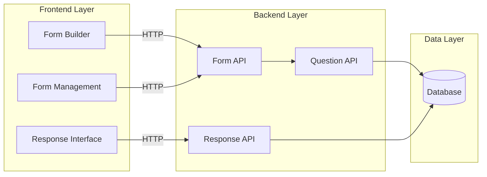
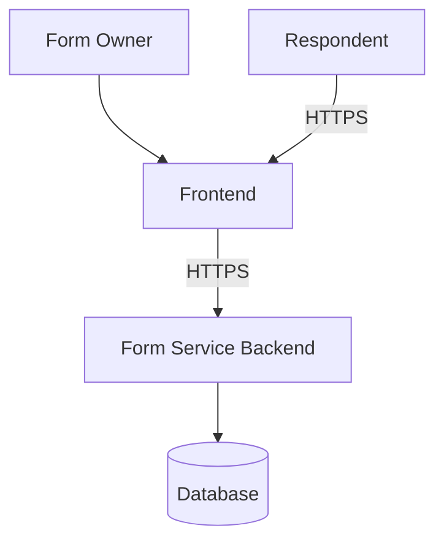
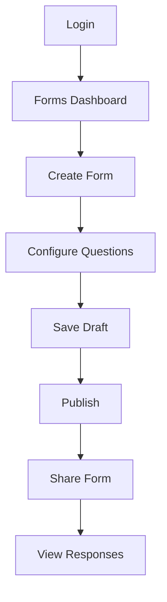
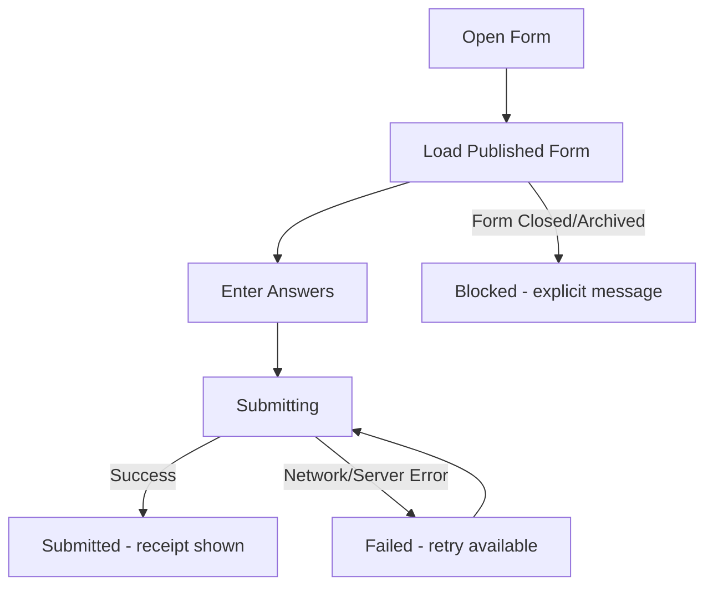

# 3. Architecture Overview

## 3.1 Big Picture



The frontend communicates with the backend through HTTP APIs.

The backend owns business rules and persistence.

The frontend does not directly access the database.

## 3.2 System Context



Authentication is provided by the existing authentication/user infrastructure.

## 3.3 User Interaction Flow



### Respondent flow



### Respondent Failure and Duplicate-Submission Handling

> Added to resolve a moderate submission gap — submission behavior under unreliable networks was previously unmodeled.

The simplified "Enter Answers → Submit → Result" flow hides three behaviors that the architecture must define explicitly:

- **In-progress answers are preserved client-side.** The frontend keeps entered answers in local component/application state (§4.1) until a submission is confirmed, so a dropped connection does not silently discard a respondent's work.
- **Submissions are idempotent.** Before the first submit attempt, the frontend generates a client-side idempotency key and sends it as an `Idempotency-Key` header on `POST /forms/:formId/responses` (see §5.1). If the request is retried with the same key — due to a timeout, dropped connection, or duplicate tap — the backend returns the original `201 Created` response instead of creating a second `Response`/`Answer` set.
- **Submission state is explicit and visible.** The UI distinguishes three states: `Submitting` (request in flight, retry-safe), `Submitted` (response accepted, receipt/confirmation ID shown), and `Failed` (safe to retry, no partial write occurred). A submission to a form that is no longer `Published` (see §2.4) fails fast with a `409 Conflict` and a clear "this form is closed" message rather than a generic error.

This closes the gap between the documented flow and the actual runtime behavior required for a reliable public-facing submission endpoint.

```
