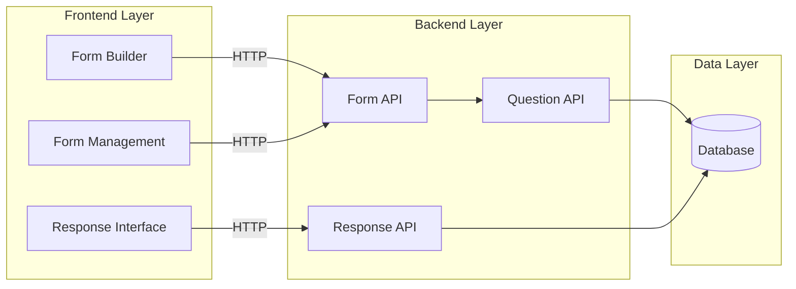
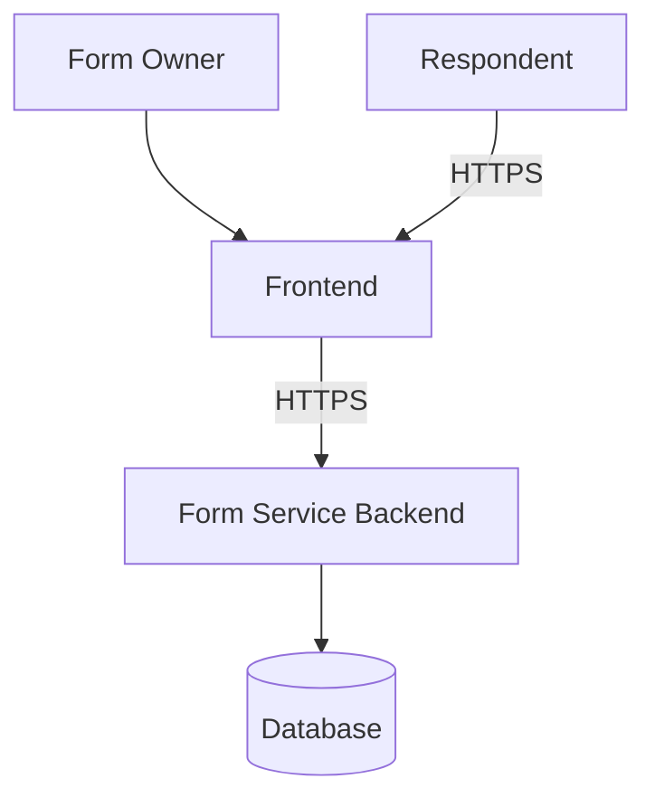
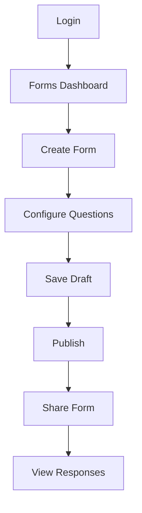
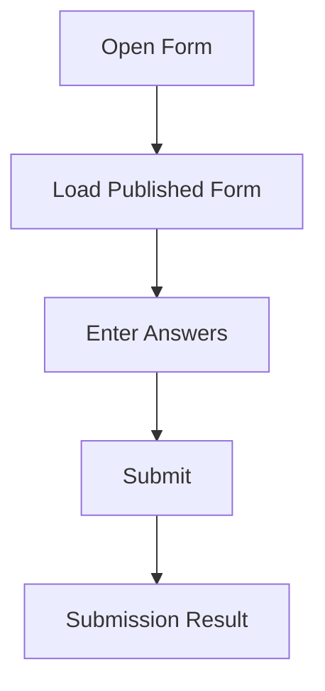

# 3. Architecture Overview

## 3.1 Big Picture

The frontend communicates with the backend through HTTP APIs.

The backend owns business rules and persistence.

The frontend does not directly access the database.

## 3.2 System Context

Authentication is provided by the existing authentication/user infrastructure.

## 3.3 User Interaction Flow

### Respondent flow

