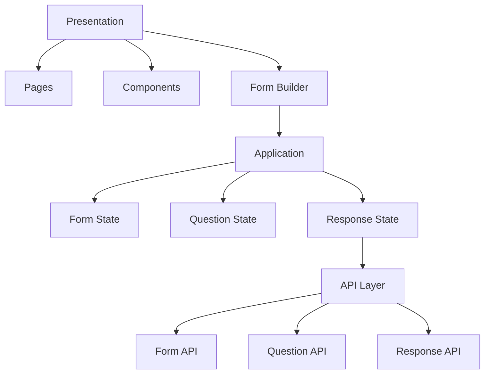
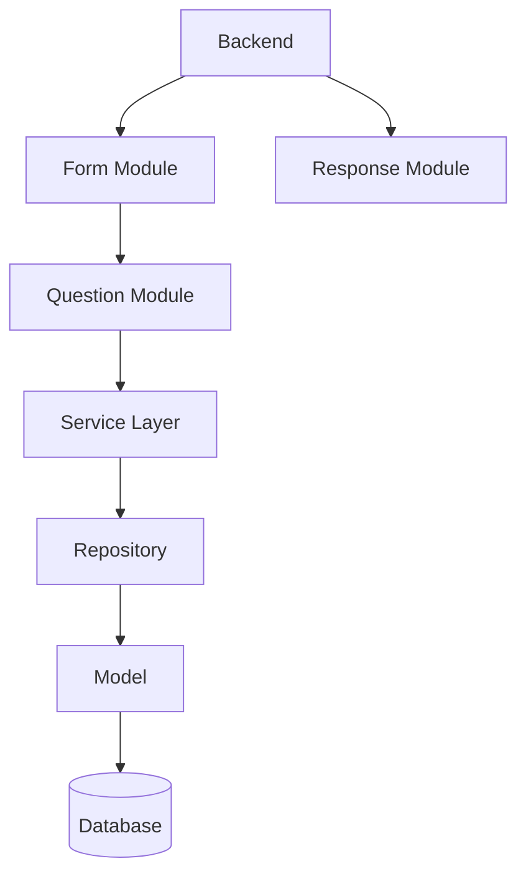
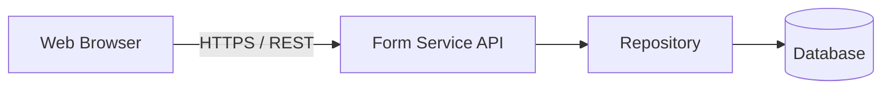
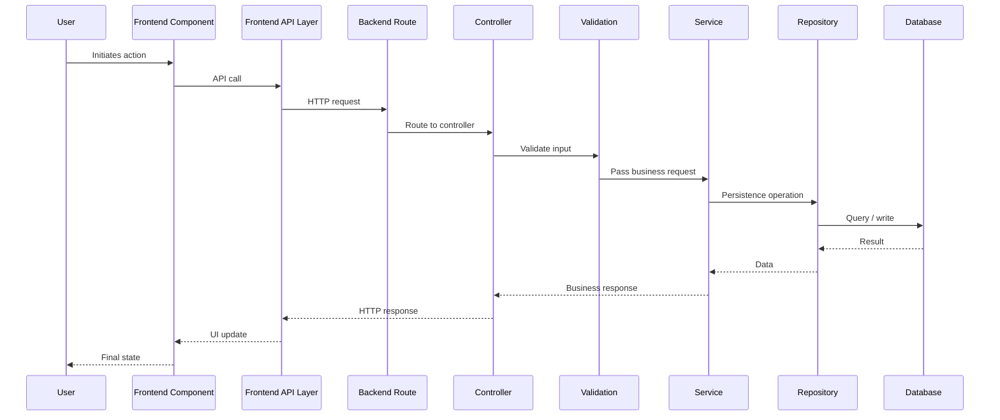

# 4. Logical and Process View

## 4.1 Frontend Logical View

### Frontend Layer Responsibilities

#### Presentation Layer

Responsible for:

- Rendering forms
- User interaction
- Form builder UI
- Validation feedback
- Loading/error states

It should not contain backend business rules.

#### Feature/Application Layer

Responsible for:

- Managing UI state
- Coordinating user actions
- Preparing API requests
- Handling API results

Examples:

- Form Management
- Form Builder
- Question Management
- Response Management

#### API Layer

Provides a single boundary between frontend features and backend APIs.

Example:

- formApi.create()
- formApi.update()
- formApi.publish()
- questionApi.create()
- questionApi.update()
- responseApi.submit()
- responseApi.getAll()

The UI should not directly construct HTTP requests throughout individual components.

## 4.2 Backend Logical View

## 4.3 Process View

The browser and backend communicate through request/reply interactions.

## 4.4 Runtime Request Flow

