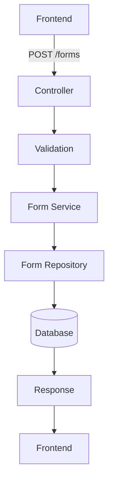
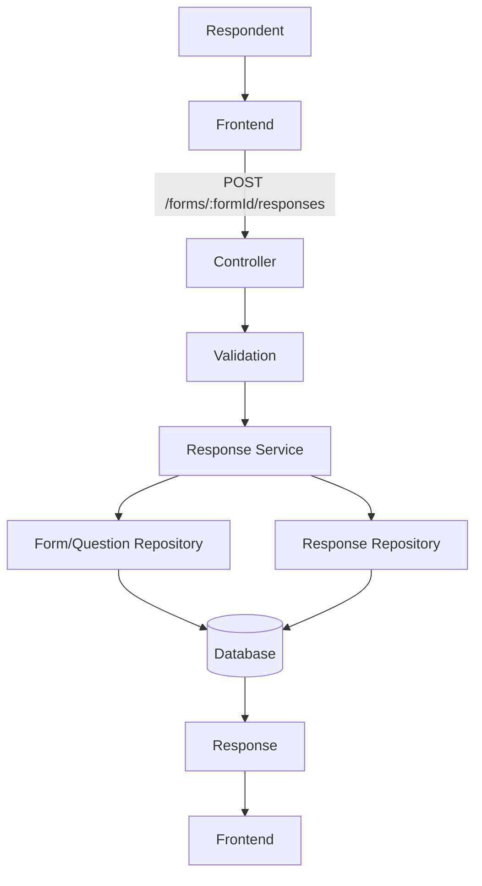
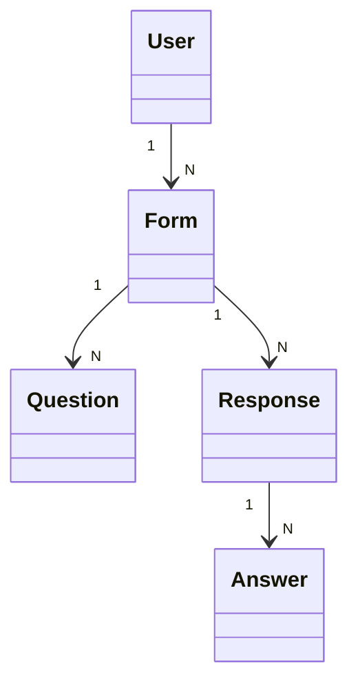
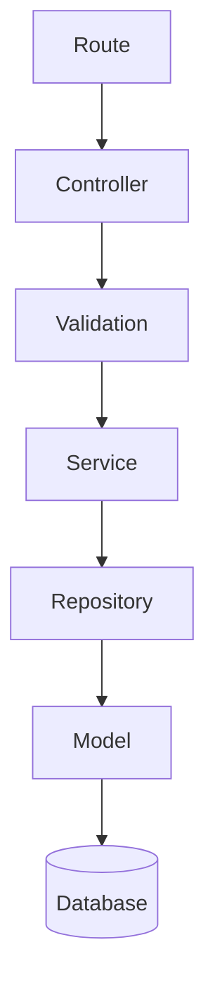
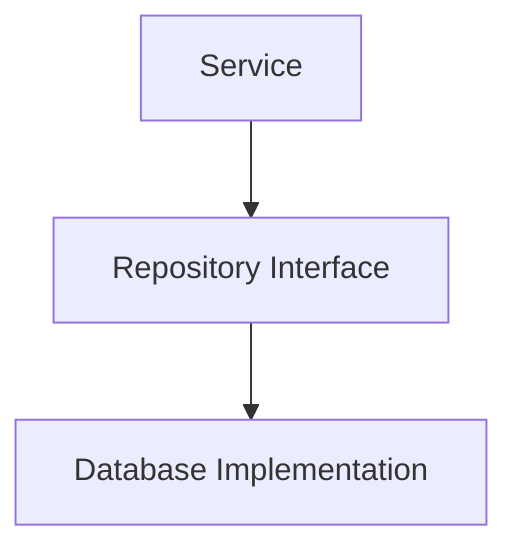
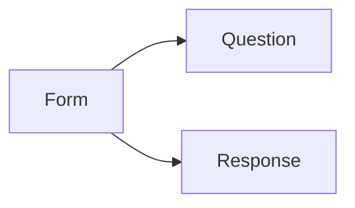

# 5. Interfaces and Data Model

## 5.1 Interface Definition

The primary interface between frontend and backend is REST/HTTP.

Example:

```http
POST /forms
GET /forms
GET /forms/:id
PATCH /forms/:id
DELETE /forms/:id

POST /forms/:id/publish

POST /forms/:formId/questions
PATCH /forms/:formId/questions/:questionId
DELETE /forms/:formId/questions/:questionId

POST /forms/:formId/responses
GET /forms/:formId/responses
```

The API contract defines:

- Request structure
- Response structure
- HTTP status codes
- Validation errors
- Authorization behavior

## 5.2 Data Flow

### Form Creation



### Response Submission



## 5.3 Data Model



The Form Service owns form-related data while user identity remains owned by the authentication/user system.

## 5.4 Architectural Patterns

### Client-Server

The frontend acts as the client and the backend acts as the server.

The client requests services through HTTP APIs, while the server owns business logic and data management.

### Layered Architecture

The backend uses:



This separates HTTP handling, business logic, and persistence.

### Repository / Data Mapper Boundary

Persistence is isolated behind repositories.



The domain/service layer therefore does not need to depend directly on database-specific operations.

### Modular Service Pattern

Form functionality is organized into feature boundaries:



Each module maintains a focused responsibility.
