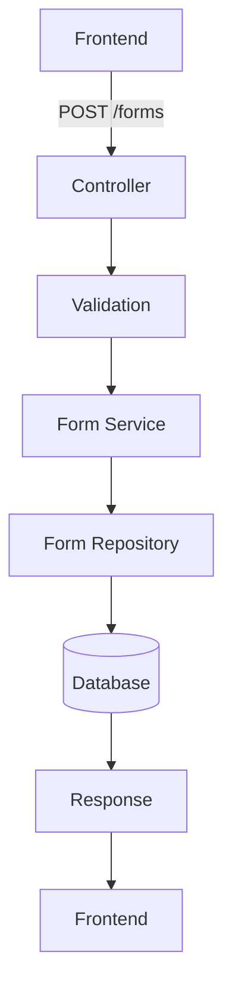
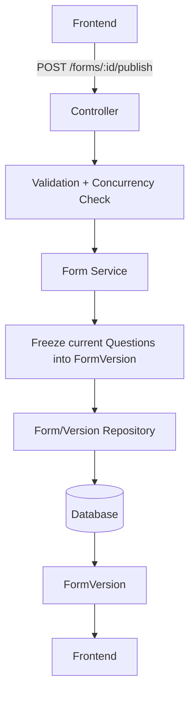
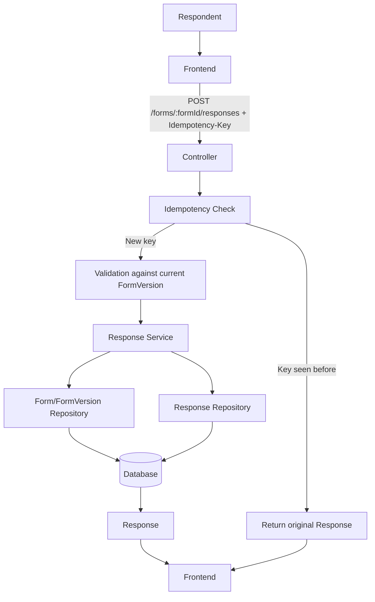
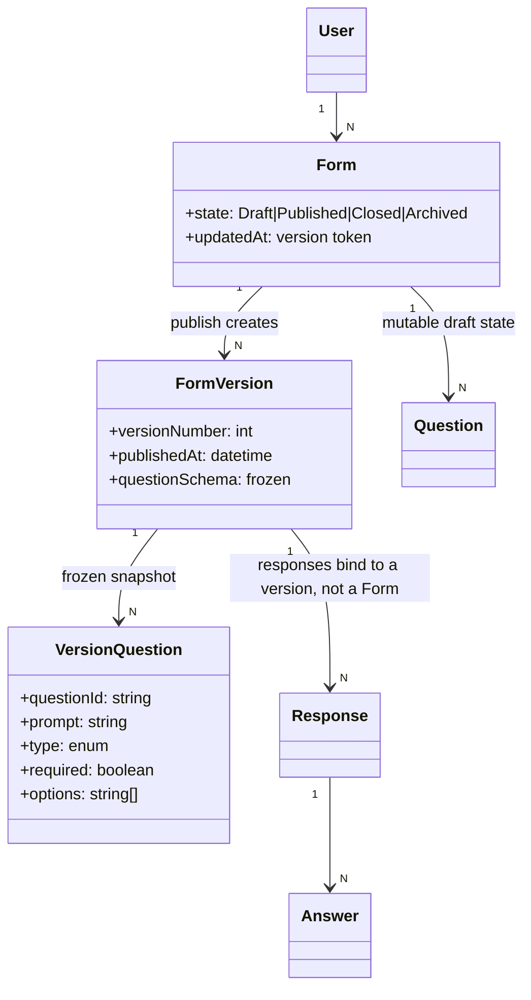
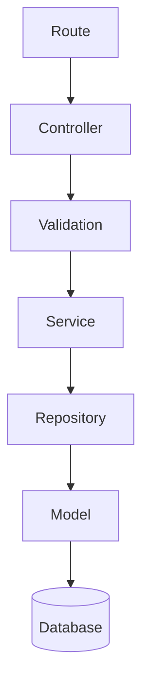
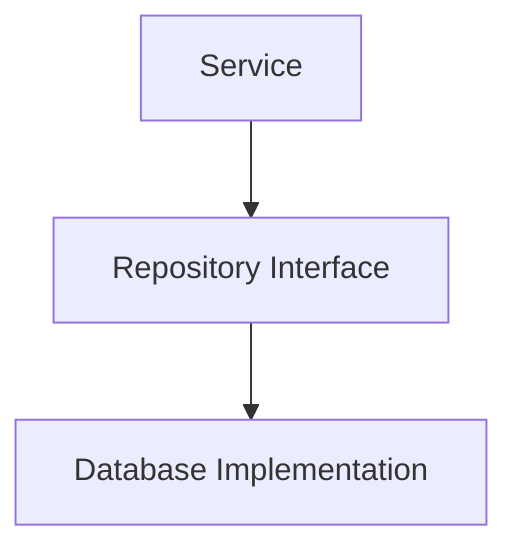
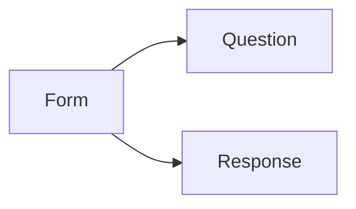

# 5. Interfaces and Data Model

## 5.1 Interface Definition

The primary interface between frontend and backend is REST/HTTP, served under a versioned base path (`/api/v1`) so breaking contract changes can ship as `/api/v2` without disrupting existing clients.

```http
    POST /forms
GET /forms
GET /forms/:id
PATCH /forms/:id
DELETE /forms/:id

POST /forms/:id/publish
POST /forms/:id/close
POST /forms/:id/reopen

GET /forms/:id/versions
GET /forms/:id/versions/:versionId

POST /forms/:formId/questions
PATCH /forms/:formId/questions/:questionId
DELETE /forms/:formId/questions/:questionId

POST /forms/:formId/responses
GET /forms/:formId/responses
GET /forms/:formId/responses/:responseId
```

### 5.1.1 API Contract Details

> Added to resolve a major API-contract gap — routes were previously listed without the structures, codes, or rules the document claimed to define.

Every endpoint follows the same contract shape:

- **Auth**: `Authorization: Bearer <token>` required unless marked *Public*. Missing/invalid token → `401 Unauthenticated`. Valid token but not permitted → `403 Forbidden` (see the authorization matrix in §6.1).
- **Errors**: all non-2xx responses use a single error envelope:
  ```json
  {
    "error": {
      "code": "VALIDATION_FAILED",
      "message": "Question 'email' requires a value.",
      "details": [{ "field": "answers[2].value", "issue": "required" }]
    }
  }
  ```
- **Pagination**: all list endpoints (`GET /forms`, `GET /forms/:formId/responses`) are cursor-based: `?limit=20&cursor=<opaque>`, response includes `{ "items": [...], "nextCursor": "..." | null }`. `limit` defaults to 20, max 100.
- **Idempotency**: all `POST` endpoints that create a resource accept an `Idempotency-Key` header. A repeated key within 24 hours returns the original response instead of creating a duplicate (see §3.3 for the response-submission case specifically).
- **Concurrency**: `PATCH`/`DELETE` on `Form` and `Question`, and state-transition operations (`publish`, `close`, `reopen`), require an `If-Match: <version>` header (see §2.4). Mismatch → `409 Conflict`.

#### Representative schema fragments

The architecture uses canonical JSON object shapes for the core resources. These are the contract fragments used by the service, and they can be lifted directly to OpenAPI or a generated SDK contract.

```json
{
  "Form": {
    "type": "object",
    "required": ["id", "title", "state", "ownerId", "createdAt", "updatedAt", "version"],
    "properties": {
      "id": { "type": "string" },
      "title": { "type": "string", "minLength": 1, "maxLength": 200 },
      "description": { "type": "string", "nullable": true },
      "state": { "enum": ["Draft", "Published", "Closed", "Archived"] },
      "ownerId": { "type": "string" },
      "currentVersionId": { "type": "string", "nullable": true },
      "createdAt": { "type": "string", "format": "date-time" },
      "updatedAt": { "type": "string", "format": "date-time" },
      "version": { "type": "integer", "minimum": 1 }
    }
  }
}
```

```json
{
  "Question": {
    "type": "object",
    "required": ["id", "formId", "type", "prompt", "required", "createdAt", "updatedAt"],
    "properties": {
      "id": { "type": "string" },
      "formId": { "type": "string" },
      "type": { "enum": ["shortText", "longText", "singleChoice", "multipleChoice", "date", "email", "number"] },
      "prompt": { "type": "string" },
      "required": { "type": "boolean" },
      "options": { "type": "array", "items": { "type": "string" }, "nullable": true },
      "placeholder": { "type": "string", "nullable": true },
      "createdAt": { "type": "string", "format": "date-time" },
      "updatedAt": { "type": "string", "format": "date-time" }
    }
  }
}
```

```json
{
  "Response": {
    "type": "object",
    "required": ["id", "formId", "formVersionId", "submittedAt", "answers"],
    "properties": {
      "id": { "type": "string" },
      "formId": { "type": "string" },
      "formVersionId": { "type": "string" },
      "submittedAt": { "type": "string", "format": "date-time" },
      "status": { "enum": ["Submitted"] },
      "answers": {
        "type": "array",
        "items": {
          "$ref": "#/components/schemas/Answer"
        }
      }
    }
  },
  "Answer": {
    "type": "object",
    "required": ["questionId", "value"],
    "properties": {
      "questionId": { "type": "string" },
      "value": {
        "oneOf": [
          { "type": "string" },
          { "type": "number" },
          { "type": "boolean" },
          { "type": "array", "items": { "type": "string" } },
          { "type": "null" }
        ]
      }
    }
  }
}
```

#### Example request/response payloads

`POST /forms`

Request:

```json
{
  "title": "Event Registration",
  "description": "Collect attendee details for the annual summit"
}
```

Success response (`201 Created`):

```json
{
  "id": "form_123",
  "title": "Event Registration",
  "description": "Collect attendee details for the annual summit",
  "state": "Draft",
  "ownerId": "user_42",
  "currentVersionId": null,
  "createdAt": "2026-09-17T10:00:00Z",
  "updatedAt": "2026-09-17T10:00:00Z",
  "version": 1
}
```

`POST /forms/:formId/responses`

Request:

```json
{
  "answers": [
    { "questionId": "q_email", "value": "alice@example.com" },
    { "questionId": "q_name", "value": "Alice" },
    { "questionId": "q_topics", "value": ["security", "ux"] }
  ]
}
```

Success response (`201 Created`):

```json
{
  "id": "resp_456",
  "formId": "form_123",
  "formVersionId": "formv_7",
  "status": "Submitted",
  "submittedAt": "2026-09-17T11:05:00Z",
  "answers": [
    { "questionId": "q_email", "value": "alice@example.com" },
    { "questionId": "q_name", "value": "Alice" },
    { "questionId": "q_topics", "value": ["security", "ux"] }
  ]
}
```

These JSON fragments are intentionally concrete enough to be used as implementation contracts while still remaining compact enough for architecture documentation. A production-grade implementation should promote them to an OpenAPI document, but the architecture already establishes the core shapes, statuses, envelopes, and semantics required by the contract.


| Method & Path                        | Auth                                     | Request / Headers                                | Success                                         | Key Errors                                                                   |
| ------------------------------------ | ---------------------------------------- | ------------------------------------------------ | ----------------------------------------------- | ---------------------------------------------------------------------------- |
| `POST /forms`                        | Owner (any authenticated user)           | `{ title, description? }`                        | `201` Form (state `Draft`)                      | `422` validation                                                             |
| `GET /forms`                         | Owner                                    | — (paginated)                                   | `200` `{items: Form[], nextCursor}`             | —                                                                           |
| `GET /forms/:id`                     | Owner, or Public if`Published`/`Closed`  | —                                               | `200` Form + current version summary            | `403`, `404`                                                                 |
| `PATCH /forms/:id`                   | Owner                                    | Partial Form fields ; Header:`if-Match`          | `200` Form                                      | `403`, `404`, `409`                                                          |
| `DELETE /forms/:id`                  | Owner                                    | —                                               | `204` (→ `Archived`, §2.4)                    | `403`, `404`                                                                 |
| `POST /forms/:id/publish`            | Owner                                    | `Request Headers: If-Match`                      | `201` new `FormVersion`                         | `403`, `404`, `409` (already published with no pending changes)              |
| `POST /forms/:id/close`              | Owner                                    | `Request Headers: If-Match`                      | `200` Form (state `Closed`)                     | `403`, `409` (not `Published`)                                               |
| `POST /forms/:id/reopen`             | Owner                                    | `Request Headers: If-Match`                      | `200` Form (state `Published`)                  | `403`, `409` (not `Closed`)                                                  |
| `GET /forms/:id/versions`            | Owner                                    | — (paginated)                                   | `200` `FormVersion[]`                           | `403`, `404`                                                                 |
| `GET /forms/:id/versions/:versionId` | Owner                                    | —                                               | `200` `FormVersion` (frozen questions)          | `403`, `404`                                                                 |
| `POST /forms/:formId/questions`      | Owner                                    | Question fields                                  | `201` Question (applies to Draft only)          | `403`, `409` (form not `Draft`)                                              |
| `PATCH .../questions/:id`            | Owner                                    | Partial fields +`If-Match`                       | `200` Question (Draft only)                     | `403`, `409`                                                                 |
| `DELETE .../questions/:id`           | Owner                                    | —                                               | `204` (Draft only)                              | `403`, `409`                                                                 |
| `POST /forms/:formId/responses`      | Public/Respondent (per form access mode) | `{ answers: [...] }` ; Header:`Idempotency-Key` | `201` Response (bound to current `FormVersion`) | `403`, `409` (form not `Published`), `422` validation against version schema |
| `GET /forms/:formId/responses`       | Owner only                               | — (paginated)                                   | `200` `{items: Response[], nextCursor}`         | `403`                                                                        |
| `GET .../responses/:responseId`      | Owner only                               | —                                               | `200` Response + Answers                        | `403`, `404`                                                                 |

## 5.2 Data Flow

### Form Creation



### Publish (Version Creation)



### Response Submission



## 5.3 Data Model

> Updated to resolve a major versioning gap — responses previously linked to mutable `Form`/`Question` records with no immutable snapshot of what the respondent actually saw.



**Key rule:** `Response` never references `Form` or the live/mutable `Question` records directly — only `FormVersion`. Because a `FormVersion` is immutable once published (§2.4), every response remains validly interpretable against exactly the question set, options, and validation rules the respondent submitted against, regardless of how the form is edited afterward. Reporting and analytics group responses by `FormVersion`, and the frontend flags when a form has newer versions than the one a given response set was collected under.

The Form Service owns form-related data (`Form`, `FormVersion`, `Question`, `Response`, `Answer`) while user identity remains owned by the authentication/user system.

## 5.4 Architectural Patterns

### Client-Server

The frontend acts as the client and the backend acts as the server.

The client requests services through HTTP APIs, while the server owns business logic and data management.

### Layered Architecture

The backend uses:



This separates HTTP handling, business logic, and persistence.

### Repository / Data Mapper Boundary

Persistence is isolated behind repositories.



The domain/service layer therefore does not need to depend directly on database-specific operations.

### Modular Service Pattern

Form functionality is organized into feature boundaries:



Each module maintains a focused responsibility.
