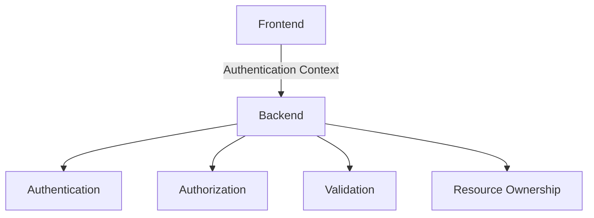

# 6. Security, Quality, and Operational Concerns

## 6.1 Security Boundary

The frontend may hide unavailable actions for usability, but authorization must always be enforced by the backend.

## 6.2 Error Handling

Communication failures use standard HTTP semantics.

| Status Code | Meaning |
|---|---|
| 400 | Invalid Request |
| 401 | Unauthenticated |
| 403 | Forbidden |
| 404 | Resource Not Found |
| 409 | Conflict |
| 422 | Validation Failure |
| 500 | Internal Server Error |

Backend errors should be centrally handled and logged.

Frontend should translate API errors into appropriate user-facing feedback.

## 6.3 Architectural Tactics

### Maintainability

- Feature-based modularization
- Clear layer boundaries
- Shared infrastructure
- Dependency inversion
- Centralized error handling

### Modifiability

- Frontend/backend separation
- Repository abstraction
- API contracts
- Extensible question configuration

### Testability

- Services independent of HTTP
- Repositories mockable
- Frontend API layer separated from UI components
- Component-level testing

### Availability

- Centralized exception handling
- Database error handling
- Stateless API design
- Pagination for large response collections

## 6.4 Extensibility

The architecture should support future functionality without restructuring existing layers.

Potential extensions:

- Anonymous Responses
- File Upload
- Conditional Questions
- Form Templates
- Analytics
- Export
- Notifications
- Collaboration
- Versioning
- External Integrations

External integrations should be introduced through interfaces rather than embedding provider-specific logic into the Form domain.
