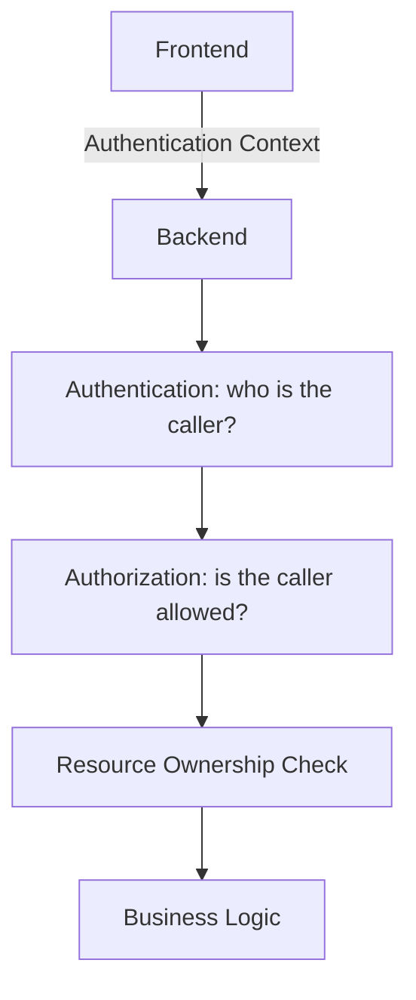
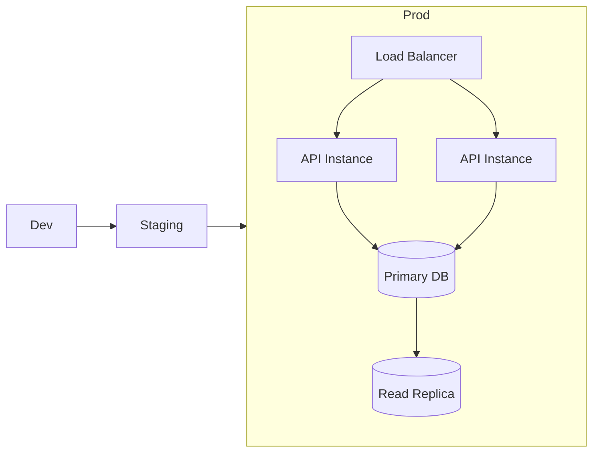

# 6. Security, Quality, and Operational Concerns

## 6.1 Authorization Model

> Added to resolve a major authorization gap — authorization was previously named ("Authentication", "Authorization", "Resource Ownership") but no per-operation policy existed.

Roles:

- **Owner** — the authenticated user who created the form.
- **Respondent (authenticated)** — a logged-in user submitting a response, when the form requires login.
- **Respondent (anonymous)** — an unauthenticated user, when the form's access mode allows it.
- **Administrator** — internal support role; access is logged and scoped to support actions only.

Every route enforces one row of this matrix before any business logic runs. `401` is returned when the caller cannot be authenticated at all; `403` is returned when the caller is authenticated but the row below denies the action.

| Resource / Operation                            | Owner                                                                         | Authenticated Respondent | Anonymous Respondent       | Administrator                           |
| ----------------------------------------------- | ----------------------------------------------------------------------------- | ------------------------ | -------------------------- | --------------------------------------- |
| Create form                                     | ✅ (becomes Owner)                                                            | ❌                       | ❌                         | ❌                                      |
| Read own form (any state)                       | ✅                                                                            | ❌                       | ❌                         | ✅ (support only, logged)               |
| Read form (Published/Closed)                    | ✅                                                                            | ✅ if access mode allows | ✅ if access mode = public | ✅                                      |
| Update / Delete / Publish / Close / Reopen form | ✅ (must own)                                                                 | ❌                       | ❌                         | ❌                                      |
| Add/Update/Delete question                      | ✅ (must own, Draft only)                                                     | ❌                       | ❌                         | ❌                                      |
| Submit response                                 | ❌ (owners cannot respond to their own form's official count — configurable) | ✅ per form access mode  | ✅ if access mode = public | ❌                                      |
| Read responses (any)                            | ✅ (must own)                                                                 | ❌                       | ❌                         | ✅ (support only, logged)               |
| Export responses                                | ✅ (must own)                                                                 | ❌                       | ❌                         | ✅ (support only, logged, rate-limited) |

**Enforcement rule:** ownership is checked in the Service layer against the resource's `ownerId`, never assumed from the route path alone, and every check is covered by a negative test (§6.7) proving that a non-owner request is rejected.

## 6.2 Data Classification and Lifecycle

> Added to resolve a moderate data-lifecycle gap — the entities in §5.3 had no field classification, retention, deletion, encryption, or recovery rules.

### Classification

| Data                                          | Classification                                                  | Handling                                                                                |
| --------------------------------------------- | --------------------------------------------------------------- | --------------------------------------------------------------------------------------- |
| `User` identity fields                        | Owned by auth system                                            | Not duplicated beyond a reference ID                                                    |
| `Form` / `FormVersion` / `Question` structure | Internal                                                        | Standard access controls                                                                |
| `Answer` values                               | **Sensitive by default** — may contain respondent-supplied PII | Encrypted at rest; access restricted to the form Owner and audited Administrator access |

### Retention and Deletion

- **Default retention**: responses are retained indefinitely while the parent form is not `Archived`, unless the Owner sets a shorter retention window at form-creation time (max retention is unbounded; minimum is 24 hours to allow immediate submission review).
- **Form deletion (Archive)**: soft-deletes the form and hides it from dashboards and public access immediately. Underlying `Response`/`Answer` rows are retained for 30 days to allow recovery, then hard-deleted by a scheduled job.
- **Individual response deletion**: an Owner may hard-delete a single response (e.g., on a respondent's erasure request). This is immediate and irreversible, and is written to the audit log.
- **Export**: Owner-initiated response export (CSV/JSON) is rate-limited and produces an audit log entry containing who exported, when, and how many records.

### Encryption and Backup

- `Answer` content is encrypted at rest; transport is HTTPS-only end-to-end (§3.2).
- Automated nightly backups, retained 30 days, stored separately from the primary database.
- Restore from backup is an Administrator action requiring documented approval, exercised periodically as a recovery drill (§6.7).

## 6.3 Error Handling

Communication failures use standard HTTP semantics, returned in the error envelope defined in §5.1.1.

| Status Code | Meaning               |
| ----------- | --------------------- |
| 400         | Invalid Request       |
| 401         | Unauthenticated       |
| 403         | Forbidden             |
| 404         | Resource Not Found    |
| 409         | Conflict              |
| 422         | Validation Failure    |
| 500         | Internal Server Error |

Backend errors should be centrally handled and logged.

Frontend should translate API errors into appropriate user-facing feedback.

## 6.4 Architectural Tactics

### Maintainability

- Feature-based modularization
- Clear layer boundaries
- Shared infrastructure
- Dependency inversion
- Centralized error handling

### Modifiability

- Frontend/backend separation
- Repository abstraction
- API contracts (§5.1.1)
- Extensible question configuration

### Testability

See the verification plan in §6.7.

### Availability

See the SLO and mechanisms in §6.6 — the tactics below reduce error surface area but do not by themselves guarantee availability.

- Centralized exception handling
- Database error handling
- Stateless API design
- Pagination for large response collections

## 6.5 Operational Architecture

> Added to resolve a major operational gap — no environment, deployment, migration, observability, or recovery design previously existed.

### Environments and Deployment

- API instances are stateless and horizontally scaled behind a load balancer; any instance can serve any request.
- Deployments are rolling/blue-green: the previous version stays available until the new version passes health checks, enabling immediate rollback.
- Database migrations follow an expand/contract pattern (additive change → deploy → backfill → remove old shape) so they are always backward-compatible with the currently running version.
- CI/CD pipeline: build → automated tests (§6.7) → migration → rolling deploy → post-deploy health check.

### Observability

- Structured logs with a correlation ID per request, propagated from the frontend API layer through every backend layer.
- Metrics: request latency, error rate, and throughput per endpoint, feeding the SLO in §6.6.
- Alerting is threshold-based on the same metrics and is routed to the designated operations/on-call owner for the affected service component. The exact escalation matrix and paging rules are part of the site operations runbook and are intentionally not embedded in this architecture document.

### Recovery Objectives

- **RPO (Recovery Point Objective): ≤ 15 minutes** — bounded by database replication/write-ahead-log shipping between backups.
- **RTO (Recovery Time Objective): ≤ 1 hour** — bounded by automated failover to the read replica plus documented manual steps for anything automated failover doesn't cover.

## 6.6 Availability and Recovery Mechanisms

> Added to resolve a moderate availability gap — the previous tactics list did not define redundancy, health checks, failover, or a measurable target.

The available SLO and recovery targets below are initial architectural objectives, not a substitute for business approval or provider-specific operational design. They should be validated against the selected hosting model, legal/compliance constraints, and operational burn-down requirements before a production service is commissioned.

- **SLO**: 99.9% monthly API availability (≈ 43 minutes of allowed downtime/month).
- **Health checks**: each API instance exposes liveness and readiness endpoints; the load balancer stops routing to an instance that fails readiness.
- **Redundancy**: multiple stateless API replicas across availability zones; database primary with a hot read replica capable of promotion.
- **Dependency timeouts**: every outbound call (database, auth service) has an explicit timeout and a bounded retry with backoff; a failing dependency degrades (e.g., read-only mode) rather than cascading.
- **Failover**: database failover to the replica is automated; other dependency failures follow the documented runbook referenced in §6.5.
- **Recovery objectives**: initial targets of `RPO ≤ 15 minutes` and `RTO ≤ 1 hour` are design assumptions that must be confirmed during detailed design and operational readiness review against the final infrastructure plan.

## 6.7 Testability and Verification Plan

> Added to resolve a moderate verification gap — testability was previously asserted ("independently testable", "mockable") without a plan tying it to the architecture's actual risk areas.

| Architectural Behavior                                               | Test Type                                    | Traces To      |
| -------------------------------------------------------------------- | -------------------------------------------- | -------------- |
| Form lifecycle transitions and invalid-transition rejection          | Integration                                  | §2.4          |
| Optimistic-concurrency conflicts (`409` on stale `If-Match`)         | Integration / concurrency                    | §2.4, §5.1.1 |
| Authorization matrix, including every "❌" cell                      | Security / negative tests                    | §6.1          |
| Response bound to immutable`FormVersion` after form edits            | Contract / data-integrity                    | §5.3          |
| Duplicate submission with repeated`Idempotency-Key`                  | Integration                                  | §3.3, §5.1.1 |
| API request/response schemas                                         | Contract tests (CI, per endpoint)            | §5.1.1        |
| Backup restore and failover                                          | Operational drill (periodic, manual trigger) | §6.5, §6.6   |
| Critical user journey: create → publish → submit → view responses | End-to-end                                   | §3.3          |

Contract tests run in CI against the schemas in §5.1.1 so frontend and backend can be verified independently, closing the traceability gap between "testable" as a stated attribute and an actual plan.

## 6.8 Extensibility

The architecture should support future functionality without restructuring existing layers.

Potential extensions:

- Anonymous Responses
- File Upload
- Conditional Questions
- Form Templates
- Analytics
- Export
- Notifications
- Collaboration
- External Integrations

External integrations should be introduced through interfaces rather than embedding provider-specific logic into the Form domain.
