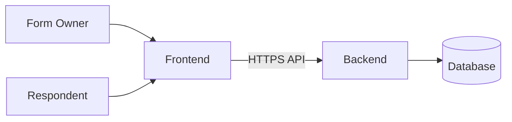

# Form Service Architecture Documentation

This documentation set is a structured split of the original Form Service Software Architecture Document. The content remains the same in substance; the presentation has been improved for readability and professional diagram styling.

## Document Structure

1. [01-Introduction.md](./01-Introduction.md)
2. [02-Background-and-Requirements.md](./02-Background-and-Requirements.md)
3. [03-Architecture-Overview.md](./03-Architecture-Overview.md)
4. [04-Logical-and-Process-View.md](./04-Logical-and-Process-View.md)
5. [05-Interfaces-and-Data-Model.md](./05-Interfaces-and-Data-Model.md)
6. [06-Security-Quality-and-Operations.md](./06-Security-Quality-and-Operations.md)
7. [07-Design-Rationale-and-Summary.md](./07-Design-Rationale-and-Summary.md)

## High-Level Overview

The Form Service is a web-based system for creating, configuring, publishing, and submitting forms.

The system consists of two primary subsystems:

- Frontend — user-facing form builder, form management, and response interfaces.
- Backend — form domain, validation, authorization, persistence, and API services.

The architecture separates presentation concerns from application and data concerns so that either side can evolve independently.

### Core Architecture

The frontend communicates with the backend through HTTP APIs. The backend owns business rules and persistence. The frontend does not directly access the database.
