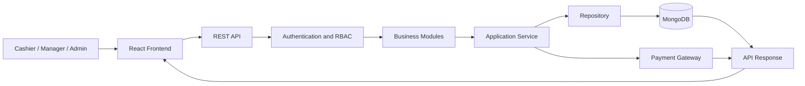
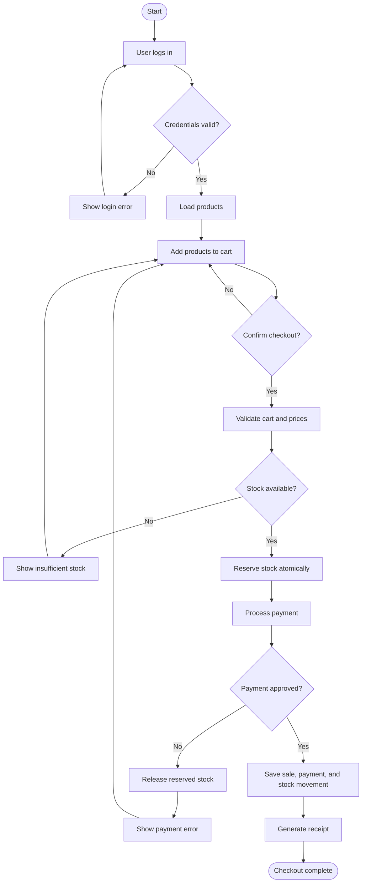
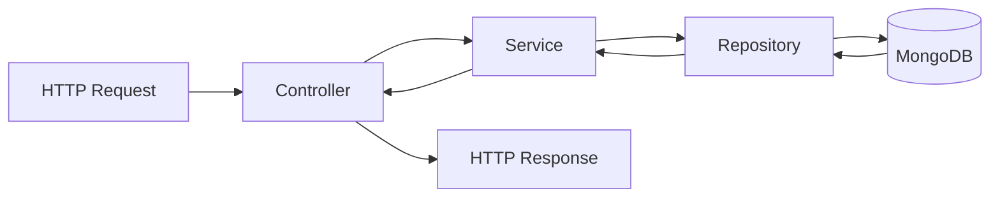

# POS System Architecture and Diagrams

[Back to Documentation Index](README.md)

## Architecture Style

The system uses a layered modular monolith. Each business module contains its own controller, service, repository, and data models.

## Overall Architecture



## Checkout Flow



## Backend Layer Flow



## Modules

- Auth: login and JWT authentication
- Users: user accounts and roles
- Inventory: products, categories, and stock
- Sales: cart, checkout, and receipts
- Payments: payment status and methods
- Customers: customer records and history
- Reports: sales and inventory summaries

## Folder Structure

### Backend

```text
backend/
└── src/
    ├── modules/
    │   ├── auth/
    │   │   ├── controller/
    │   │   ├── service/
    │   │   ├── repository/
    │   │   └── routes.ts
    │   ├── users/
    │   ├── inventory/
    │   ├── sales/
    │   ├── payments/
    │   ├── customers/
    │   └── reports/
    ├── config/
    │   ├── database.ts
    │   └── env.ts
    ├── middleware/
    │   ├── authentication.ts
    │   ├── authorization.ts
    │   ├── validation.ts
    │   └── error-handler.ts
    ├── infrastructure/
    │   ├── logger/
    │   └── payment-gateway/
    └── app.ts
```

### Frontend

```text
frontend/
└── src/
    ├── pages/
    │   ├── Login/
    │   ├── POS/
    │   ├── Inventory/
    │   ├── Sales/
    │   ├── Reports/
    │   └── Customers/
    ├── components/
    │   ├── common/
    │   └── pos/
    ├── services/
    │   ├── auth.api.ts
    │   ├── inventory.api.ts
    │   └── sales.api.ts
    ├── hooks/
    ├── store/
    ├── types/
    └── utils/
```

## Layer Responsibilities

| Layer | Responsibility |
|---|---|
| Controller | Handles HTTP requests and responses |
| Service | Contains business logic |
| Repository | Performs database operations |
| Model | Defines MongoDB document structure |
| Middleware | Handles authentication, authorization, and validation |
