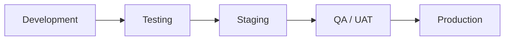

# POS Testing and Deployment

[Back to Documentation Index](README.md)

## Testing Strategy

### Unit Testing

Test authentication, stock validation, payment calculations, and core services.

### Integration Testing

Test login, product management, checkout, payment processing, and stock updates.

### Important Test Cases

- Invalid login is rejected.
- Cash checkout creates a sale and receipt.
- Failed card payment does not create a completed sale.
- Concurrent checkouts cannot make stock negative.
- Reusing an idempotency key does not create a duplicate sale.
- Cashier cannot access manager or admin functions.

## Environments

| Environment | Purpose |
|---|---|
| Development | Local development |
| Staging | QA and user acceptance testing |
| Production | Live store system |

## Deployment Flow



## Environment Variables

```env
MONGODB_URI=mongodb://localhost:27017/pos
JWT_SECRET=your-secret
JWT_EXPIRES_IN=1d
PORT=5000
FRONTEND_ORIGIN=http://localhost:5173
PAYMENT_GATEWAY_KEY=your-key
```
